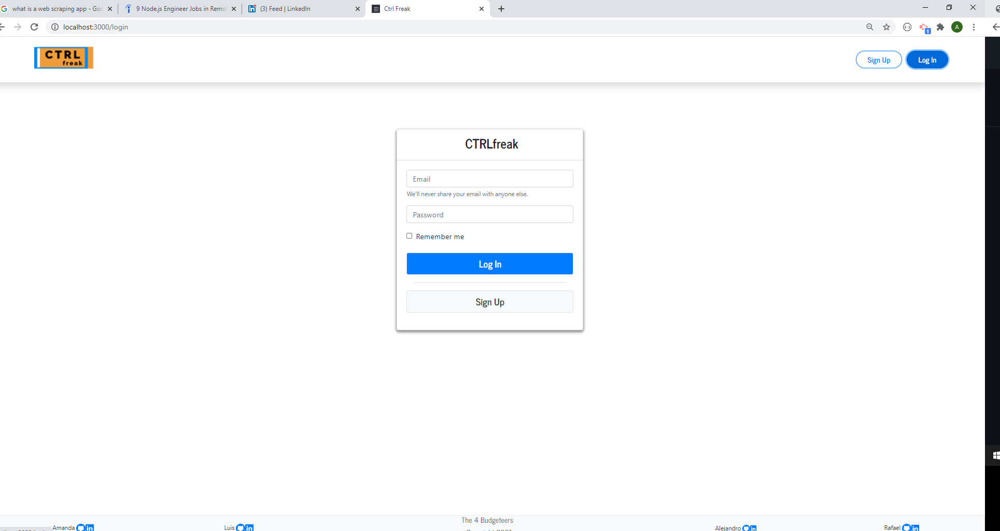

# CTRLfreak

## Description
Many people do not pay attention to expiration dates and due dates of bills, if it isn't coming out automatically. Due to this, we created this app to help users organize the chaos! This app lets users keep an inventory of groceries, that will color code the table when it gets close to the expiration date. As well as letting you add your bills to keep track of due dates. The user can also see how they are budgeting. Where they are spending their money and how much everything adds up with a budget total. Enjoy cutting out the chaos! Happy organizing! 

*https://github.com/AmandaLN/CTRLfreak

*

## Technologies

ReactJS

MongoDB

Mongoose

CSS/Bootstrap

Node

Axios

Chart.js

Express

Passport

PWA

## Usage

## Maintainers
Amanda Nelson

Rafael Vasques

Alejandro Castro

Luis Hernandez

## License
[MIT](https://choosealicense.com/licenses/mit/)